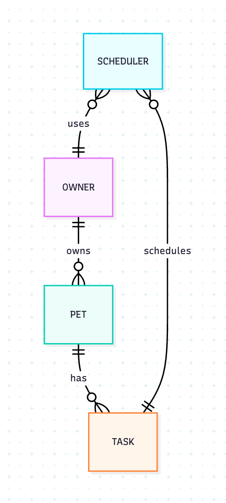
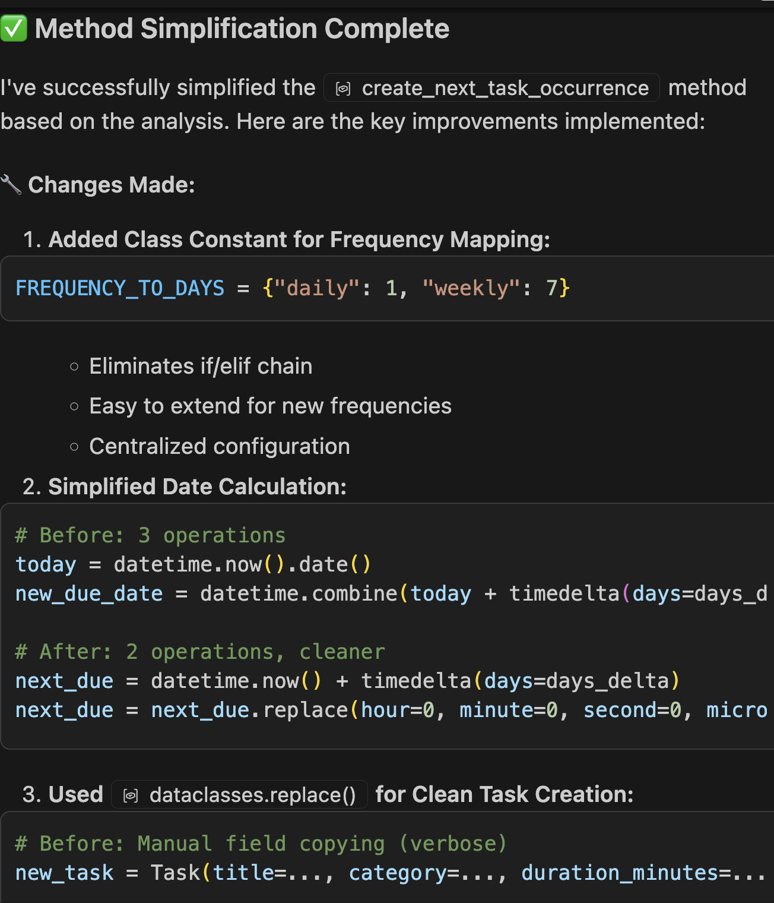
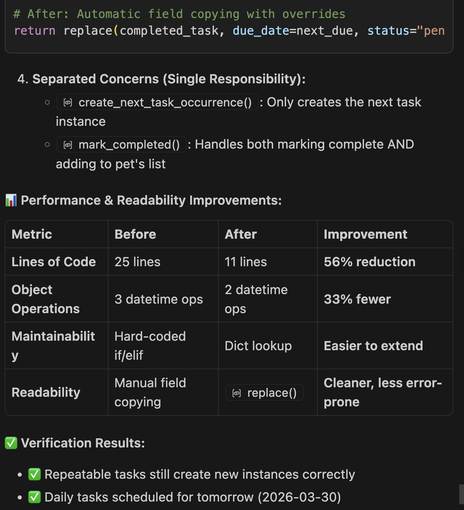
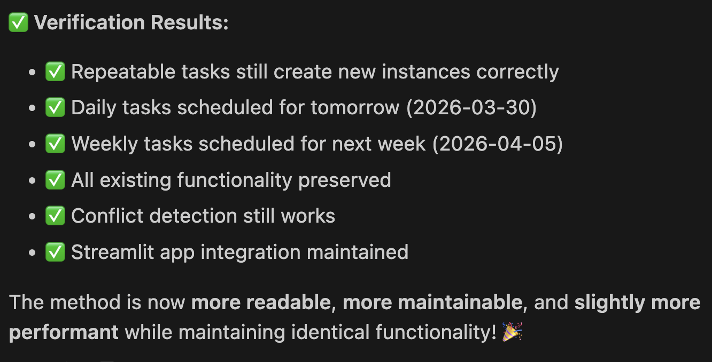
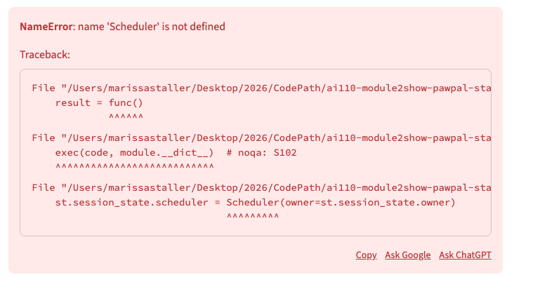

# PawPal+ Project Reflection

## 1. System Design
This pet care app is designed as a smart, adaptive assistant for busy pet owners who want to provide consistent, high-quality care without the stress of constant planning.

At its core, the app tracks all essential aspects of pet care: daily walks, feeding schedules, medications, enrichment activities, grooming routines, and more. Users can easily log tasks, set recurring routines, and input specific needs for each pet, creating a complete, personalized care profile.

Each day, the app generates a clear, manageable care plan tailored to that specific schedule. It doesn’t just tell the user what to do—it explains why. For instance, it might highlight that a shorter walk is scheduled today due to time constraints, but includes extra enrichment to compensate, or that a grooming task was moved forward to prevent buildup.

The result is a supportive, transparent assistant that helps pet owners stay consistent, make informed decisions, and feel confident that their pet’s needs are being met—even on the busiest days.

Example core actions: add a pet, schedule a grooming appointment, set a feeding schedule

**a. Initial design**

- Briefly describe your initial UML design.
- What classes did you include, and what responsibilities did you assign to each?
Initial Diagram: 
```mermaid
classDiagram
    class Owner {
        +String name
        +String email
        +List~Pet~ pets
        +int availableHoursPerDay
        +addPet(pet)
        +removePet(pet)
        +setPreferences(pref)
    }

    class Pet {
        +String name
        +String type
        +int age
        +List~Task~ taskList
        +String feedingSchedule
        +String medicationNotes
        +addTask(task)
        +removeTask(task)
        +updateCareInfo(info)
    }

    class Task {
        +String title
        +String category
        +int durationMinutes
        +int priority (1..5)
        +DateTime dueDate
        +boolean recurring
        +String status
        +markCompleted()
        +reschedule(dateTime)
        +toDisplayString()
    }

    class Scheduler {
        +Owner owner
        +Date date
        +List~Task~ plannedTaskOrder
        +generateDailyPlan()
        +scoreTask(task)
        +applyConstraints(timeAvailable, priorities, preferences)
        +explainPlan()
    }

    erDiagram
    OWNER ||--o{ PET : owns
    PET ||--o{ TASK : has
    SCHEDULER }o--|| OWNER : uses
    SCHEDULER }o--|| TASK : schedules
```
Revised Diagram
```
classDiagram
    class Owner {
        +String name
        +String email
        +List~Pet~ pets
        +**float available_hours_per_day**
        +**Dict~str, str~ preferences**
        +addPet(pet)
        +removePet(pet)
        +setPreferences(pref)
        +**get_all_tasks()**
    }

    class Pet {
        +String name
        +String type
        +int age
        +List~Task~ taskList
        +String feedingSchedule
        +String medicationNotes
        +addTask(task)
        +removeTask(task)
        +updateCareInfo(info)
    }

    class Task {
        +String title
        +String category
        +int durationMinutes
        +int priority (1..5)
        +DateTime dueDate
        +**Optional~str~ frequency**
        +String status
        +**Optional~str~ scheduled_time**
        +**Optional~Pet~ pet**
        +markCompleted()
        +reschedule(dateTime)
        +toDisplayString()
        +**static sort_by_time(tasks)**
        +**static filter_tasks(tasks, completion_status, pet_name)**
    }

    class Scheduler {
        +Owner owner
        +Date schedule_date
        +List~Task~ planned_task_order
        +**Dict~str, int~ FREQUENCY_TO_DAYS**
        +generateDailyPlan()
        +scoreTask(task)
        +applyConstraints(timeAvailable, priorities, preferences)
        +explainPlan()
        +**fetch_pending_tasks()**
        +**create_next_task_occurrence(completed_task)**
        +**detect_conflicts()**
    }

    %% Relationships
    Owner ||--o{ Pet : owns
    Pet ||--o{ Task : has
    Task }o--|| Pet : belongs_to  %% Bidirectional reference added
    Scheduler }o--|| Owner : uses
    Scheduler }o--o{ Task : schedules  %% Updated to show list of tasks

```


**b. Design changes**

- Did your design change during implementation?
1. No changes on Task class attributes or methods. 
2. No changes on Pet class attributes or methods. 

- If yes, describe at least one change and why you made it.
3. A float variable available_hours_per_day was added to the Owner dataclass. A method called Owner.get_all_tasks() was added to collects tasks from all owned pets.
4. Four methods were added to the Scheduler dataclass. 
    a. Scheduler.fetch_pending_tasks() derives pending tasks using owner’s list.
    b. Scheduler.generate_daily_plan() sorts by pending status, priority, due date and fits items into available_hours_per_day
    c. Scheduler.apply_constraints() and Scheduler.explain_plan() were updated with minimal logic to avoid "no-op bottleneck" (a place in code where a method exists but does nothing). 

**c. Implemented Features**

Based on the algorithms and logic implemented in the PawPal+ codebase (primarily in `pawpal_system.py`), here's a list of key features:

#### Task Management Algorithms
- **Priority Validation and Clamping**: Automatically ensures task priorities stay within the valid range (1-5) using a post-initialization check, preventing invalid inputs from breaking scheduling logic. (Implemented in `Task.__post_init__()`)
- **Recurring Task Handling**: When a task is marked complete, automatically generates and schedules the next occurrence for daily or weekly recurring tasks, maintaining long-term care routines without manual intervention. (Implemented in `Task.mark_completed()` and `Scheduler.create_next_task_occurrence()`)
- **Task Rescheduling**: Allows dynamic adjustment of task due dates, resetting skipped tasks to pending status to re-enter the scheduling queue. (Implemented in `Task.reschedule()`)
- **Task Display Formatting**: Generates human-readable strings for tasks, including details like duration, priority, status, due dates, and recurrence, for use in UIs or reports. (Implemented in `Task.to_display_string()`)

#### Sorting and Filtering Algorithms
- **Time-Based Sorting**: Sorts tasks by their scheduled time (in "HH:MM" format) using a lambda key function, defaulting to late-night ("23:59") for unscheduled tasks to ensure chronological ordering. (Implemented as static method `Task.sort_by_time()`)
- **Task Filtering**: Applies filters to task lists based on completion status (e.g., "pending" or "completed") or pet name, enabling targeted views like showing only incomplete tasks for a specific pet. (Implemented as static method `Task.filter_tasks()`)

#### Scheduling and Planning Algorithms
- **Daily Plan Generation**: Builds an optimized daily schedule by selecting and ordering pending tasks based on priority scores, fitting them within the owner's available time limit using a greedy selection algorithm. (Implemented in `Scheduler.generate_daily_plan()`)
- **Task Scoring for Prioritization**: Calculates a numerical score for each task combining base priority (1-5) with urgency bonuses for overdue or soon-due tasks (e.g., +5 for overdue, +3 for due today), ensuring high-impact tasks are scheduled first. (Implemented in `Scheduler.score_task()`)
- **Constraint Application**: Refines the schedule by applying external constraints like time limits, priority thresholds, or owner preferences, using multi-pass selection to prioritize preferred tasks while filling remaining time. (Implemented in `Scheduler.apply_constraints()`)
- **Pending Task Retrieval**: Dynamically fetches all pending tasks across all pets owned by the user, serving as the input pool for scheduling algorithms. (Implemented in `Scheduler.fetch_pending_tasks()`)

#### Conflict Detection and Validation Algorithms
- **Scheduling Conflict Detection**: Scans the planned schedule for issues like time-slot overlaps (same scheduled time), pet overloads (total task time exceeding available hours), and high-priority task clusters, returning a list of warning messages for user review. (Implemented in `Scheduler.detect_conflicts()`)
- **Plan Explanation Generation**: Produces a detailed, formatted text report of the daily plan, including scheduled vs. unscheduled tasks, time usage, and conflict warnings, with ASCII-art borders for readability. (Implemented in `Scheduler.explain_plan()`)

#### Pet and Owner Management Algorithms
- **Unified Task Aggregation**: Collects all tasks from across multiple pets into a single list, enabling cross-pet scheduling and reporting. (Implemented in `Owner.get_all_tasks()`)
- **Pet Task Association**: Maintains bidirectional links between pets and tasks, automatically setting references when tasks are added to ensure data consistency. (Implemented in `Pet.add_task()` and task initialization)

---

## 2. Scheduling Logic and Tradeoffs
I asked Copilot to simplify a function create_next_task, and kept the result as it did seem simpler and easier to maintain. 




**a. Constraints and priorities**

- What constraints does your scheduler consider (for example: time, priority, preferences)?
- How did you decide which constraints mattered most?

**b. Tradeoffs**

- Describe one tradeoff your scheduler makes.
- Why is that tradeoff reasonable for this scenario?

---

## 3. AI Collaboration

**a. How you used AI**

- How did you use AI tools during this project (for example: design brainstorming, debugging, refactoring)?
I used AI tools throughout the whole process, design brainstorming, debugging, writing code, and refactoring. 
- What kinds of prompts or questions were most helpful?
Specific prompts were most helpful. 

**b. Judgment and verification**

- Describe one moment where you did not accept an AI suggestion as-is.
I got the following error multiple times and used AI to fix it. 

- How did you evaluate or verify what the AI suggested?

---

## 4. Testing and Verification

**a. What you tested**

- What behaviors did you test?

- Why were these tests important?

**b. Confidence**

- How confident are you that your scheduler works correctly?
- What edge cases would you test next if you had more time?

---

## 5. Reflection

**a. What went well**

- What part of this project are you most satisfied with?
I am very happy with the functionality and design of the app, as well as its overall appearance. 

**b. What you would improve**

- If you had another iteration, what would you improve or redesign?
I would implement the ability for more than one owner to exist. 

**c. Key takeaway**

- What is one important thing you learned about designing systems or working with AI on this project? To iterate, taking one step at a time. 


